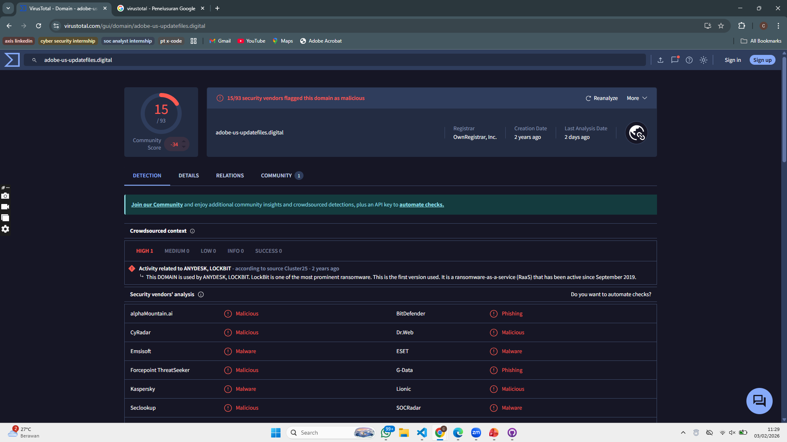
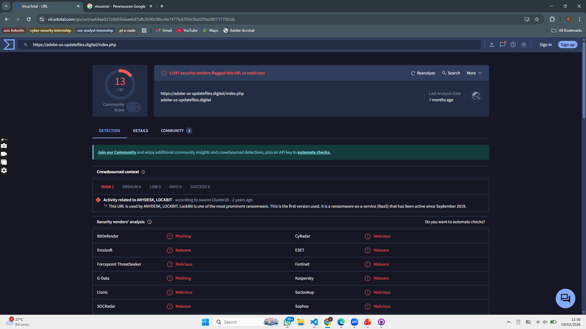
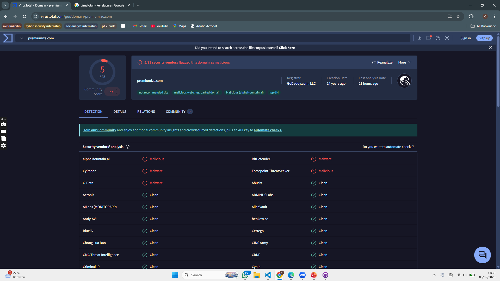
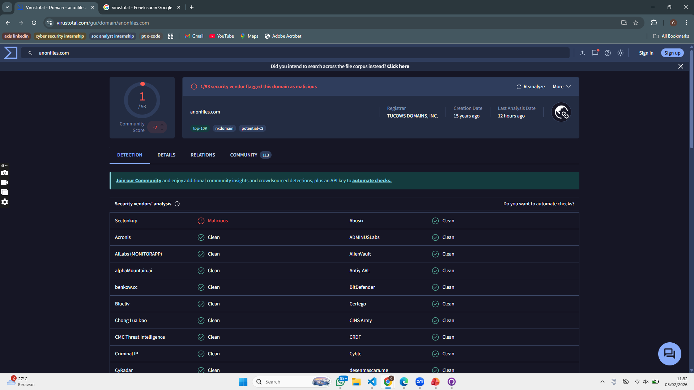
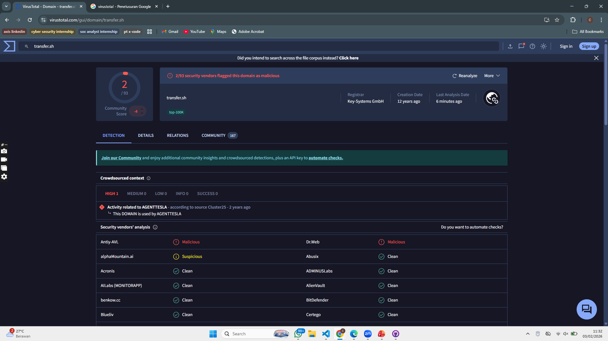

## LockBit 3.0 — Domain/URL IOC

| No | Domain/URL | Peran / Deskripsi | Sumber | Tanggal |
|---|-------------|------------------|---------|---------|
|1|`adobe-us-updatefiles[.]digital`|Callback domain malware LockBit 3.0 masquerade domain|CISA AA23-325A|21 Nov 2023|
|2|`https://adobe-us-updatefiles.digital/index[.]php`|Specific callback URL used by malware|CISA AA23-325A|21 Nov 2023|
|3|`premiumize[.]com`|File sharing service leveraged for exfiltration|Joint Advisory LockBit 3.0|Mar 2023|
|4|`anonfiles[.]com`|Public file share used during post-compromise data transfer|Joint Advisory LockBit 3.0|Mar 2023|
|5|`transfer[.]sh`|CLI file transfer site used for stolen data|Joint Advisory LockBit 3.0|Mar 2023|

## Threat Intelligence Result (Virus Total)
### 1. adobe-us-updatefiles[.]digital

### 2. https[:]//adobe-us-updatefiles.digital/index.php

### 3. premiumize[.]com

### 4. anonfiles[.]com

### 5. transfer[.]sh

