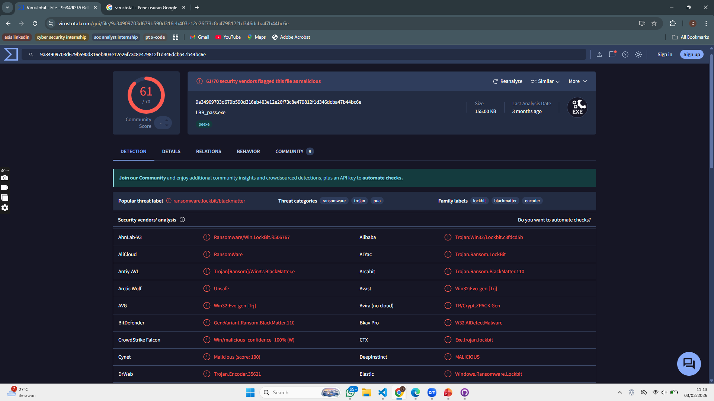
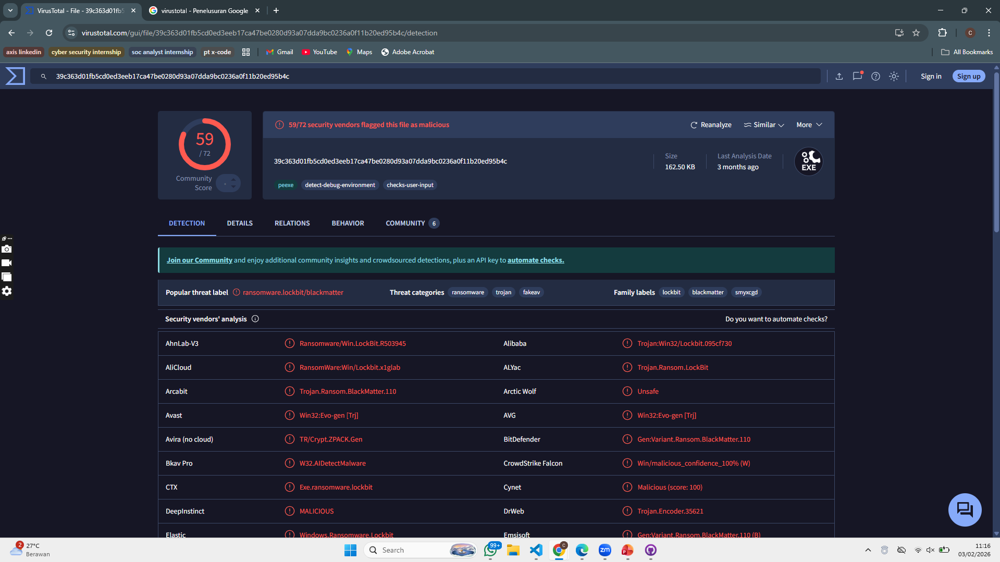
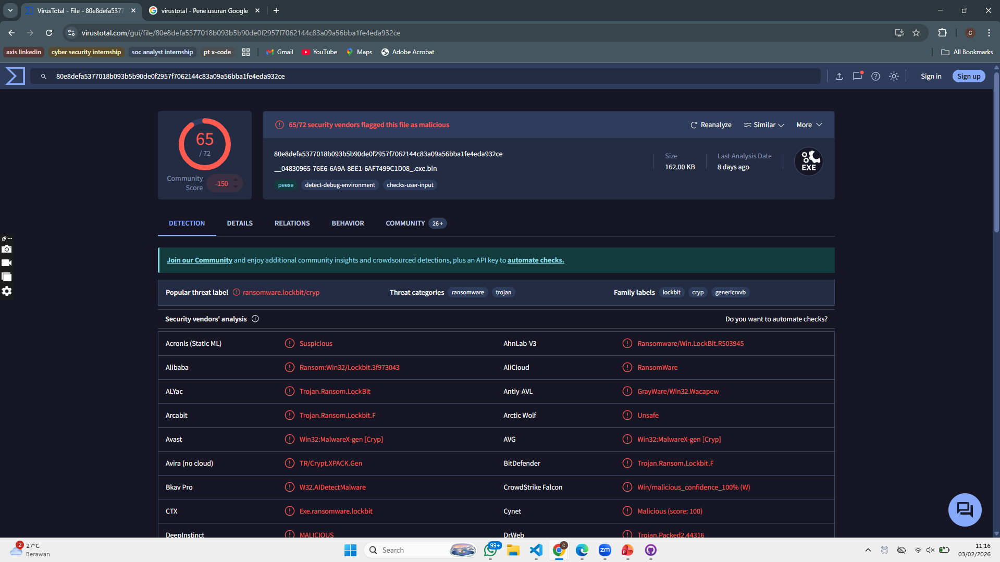
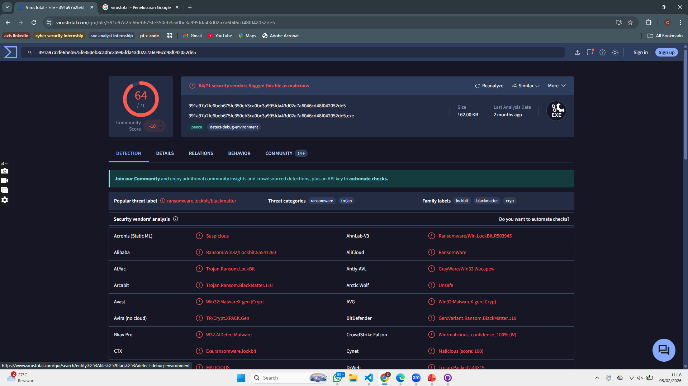
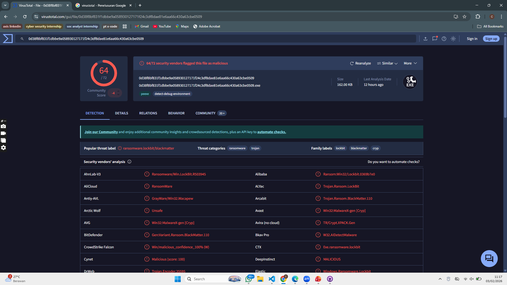

## LockBit 3.0 — File Hash IOC (SHA-256)

| No | Hash SHA-256 | Deskripsi | Sumber | Tanggal |
|---|--------------|-----------|--------|---------|
|1|`0d38f8bf831f1dbbe9a058930127171f24c3df8dae81e6aa66c430a63cbe0509`|Sample LockBit 3.0 ransomware|BlackBerry blog|Juli 2022|
|2|`9a34909703d679b590d316eb403e12e26f73c8e479812f1d346dcba47b44bc6e`|Variant LockBit 3.0 template|BlackBerry blog|Juli 2022|
|3|`39c363d01fb5cd0ed3eeb17ca47be0280d93a07dda9bc0236a0f11b20ed95b4c`|LockBit 3.0 binary sample|BlackBerry blog|Juli 2022|
|4|`80e8defa5377018b093b5b90de0f2957f7062144c83a09a56bba1fe4eda932ce`|Sample malware yang dianalisis secara teknis|TXOne Networks|Apr 2023|
|5|`391a97a2fe6beb675fe350eb3ca0bc3a995fda43d02a7a6046cd48f042052de5`|Contoh hash sample LockBit 3.0|BlackBerry blog|Juli 2022|

## Threat Intelligence Result (Virus Total)
### 1. 0d38f8bf831f1dbbe9a058930127171f24c3df8dae81e6aa66c430a63cbe0509

### 2. 9a34909703d679b590d316eb403e12e26f73c8e479812f1d346dcba47b44bc6e

### 3. 39c363d01fb5cd0ed3eeb17ca47be0280d93a07dda9bc0236a0f11b20ed95b4c

### 4. 80e8defa5377018b093b5b90de0f2957f7062144c83a09a56bba1fe4eda932ce

### 5. 391a97a2fe6beb675fe350eb3ca0bc3a995fda43d02a7a6046cd48f042052de5

