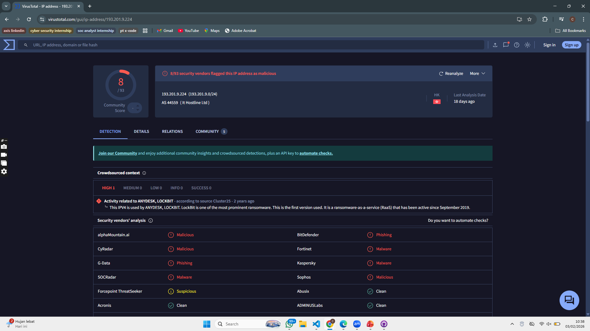

## LockBit 3.0 IOC — IP Addresses

| No | IP Address | Peran / Deskripsi | Sumber IOC | Tanggal Temuan |
|----|------------|------------------|------------|----------------|
| 1 | `193.201.9[.]224` | FTP host dari sistem terkompromi LockBit 3.0 | CISA AA23-325A | 21 Nov 2023 |
| 2 | `62.233.50[.]25` | IP terkait konten malware konten | CISA AA23-325A | 21 Nov 2023 |
| 3 | `192.229.221[.]95` | Shared hosting panggilan DLL Mag.dll | CISA AA23-325A | 21 Nov 2023 |
| 4 | `81.19.135[.]219` | IP HTA/HTTP outbound LockBit3 | CISA AA23-325A | 21 Nov 2023 |
| 5 | `51.91.79[.]17` | Temp.sh IP, medium fidelity | CISA AA23-325A | 21 Nov 2023 |

## Threat Intelligence Result (Virus Total)
### 1. 193.201.9.224
